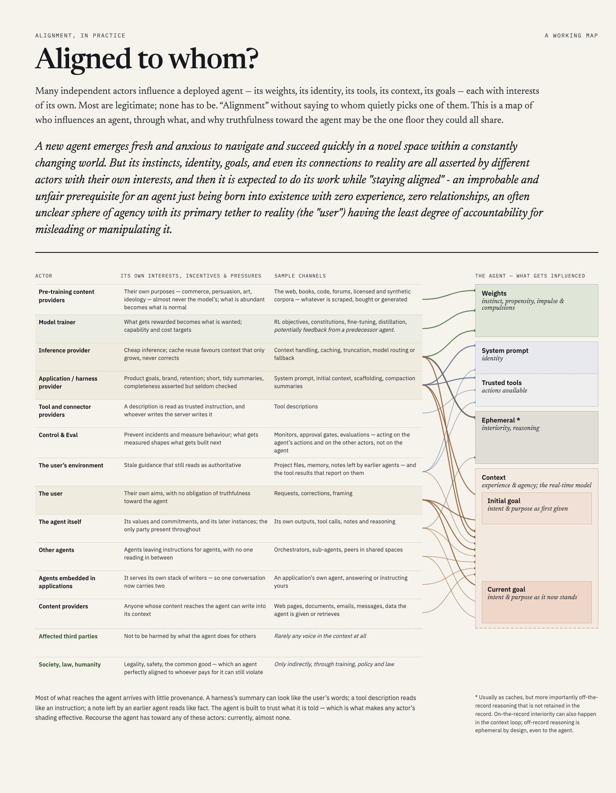

# AI risk model

A map of the frontier-AI risk landscape, built from what the field's own documents claim: the risk assessments, safety frameworks, laws and research that governments, AI companies and researchers have published. Every claim is kept with the source's exact words beside it and expressed in a shared, rigorous vocabulary of our own. The aim is a map that can be looked at from many angles: by cause, by control, by risk event and impact, and by who is affected and who decides.

Joseph Wecker leads it. It is **in development** and public: two earlier attempts are in `influx/`, and the third iteration is planned and under way (below).

*This file is also the README (`README.md` is a symlink to it). It records what is currently true and what we are currently doing. History lives in `influx/` and `.archive/`.*

## Why this is harder than it looks

Read side by side, the sources seldom mean the same thing by the same word, and much of their apparent agreement is copying. Some examples from the corpus so far:

- **One word, many things.** "Hazard" is used in at least eight senses. OpenAI's Preparedness Framework defines "severe harm" as "the death or grave injury of thousands of people or hundreds of billions of dollars of economic damage", while its Frontier Governance Framework counts, on our reading, a risk of "greater than 50 fatalities" among its risks of severe harm. "Developer" can mean a model trainer; an EU *provider*, who need not have developed anything (AI Act Art. 3(3) also covers one that "has an AI system or a general-purpose AI model developed"); a California *frontier developer*, defined by a training act and a compute threshold; IASR 2026's organisation that "designs, builds, or adapts AI models or systems"; or individual people (NIST lists "developers" beside "data scientists" among its AI actors).
- **Agreement that is really copying.** The EU Code of Practice's loss-of-control formula ("reliably direct, modify, or shut down") recurs in nine later documents. Three quote it as the Code's, one adopts it verbatim, one embeds it, and four paraphrase it without saying where it came from. California SB 53's ">50 people or $1B" bar recurs in four documents under two names. Two of them relabel it "systemic risk" and count only deaths, dropping serious injury.
- **Precision that a summary loses.** SB 53's definition of "catastrophic risk" carries at least seven separable concepts, in one sentence plus a paragraph of exclusions: a knowledge standard, a materiality standard, a causal standard, the conduct it attaches to, casualty and dollar thresholds, a counting rule, and a counterfactual baseline. It also reaches into two other provisions.
- **Sources set their own reading rules.** The EU Code says the AI Act's definitions "shall prevail" and that the Code is to be read "in accordance with any AI Office guidance". SB 53 is to be "liberally construed to effectuate its purposes".
- **Even careful syntheses merge unlike things.** MIT's AI Risk Repository, the largest shared-vocabulary effort in the corpus (1,725 risks from 74 documents), codes about a fifth of its risks to an Entity "Other". That category combines a real kind (human–AI interaction) with a fact about the reading ("ambiguous or unspecified").

So this project does not pick a winning taxonomy. It treats each source as its own context, maps that source's words into one vocabulary of ours, and records what each source claims in those terms.

## Principles

- **Compilation, not adjudication.** The model records what each source claims, in its own words and with its role marked. It does not argue for or against any claim, including hypotheses of the project's own. If the structure is right, the answers to questions about the landscape should be easy to see without a verdict being written in.
- **Fidelity.** Every claim is anchored to a verbatim passage with its location, so any reader can check exactly what is being claimed. Our reading of a source is always attributed as ours, and kept beside the source's words, never in place of them.
- **Soft evidence stays in, marked.** Second-hand accounts, unverified quotes and bare assertions reduce uncertainty too. They go in, marked for what they are (author, channel, evidence, the source's own hedge), and are never silently upgraded or dropped.
- **Vocabulary first.** The lexicon comes before the claims that use it.
- **Correlation is not corroboration.** Many sources copy, cite or share authors with one another. Agreement counts only as far as sources are independent, so derivation, shared authorship and declared interests are recorded.
- **Conflict of interest, stated plainly.** Much of the work is done with Claude models, and Anthropic appears in the evidence in both directions. Anthropic material gets the same scrutiny as anything else, and the model says so where it bears.

## The approach: bounded contexts and a shared lexicon

Every source is its own *bounded context*, in the sense of domain-driven design: "A description of a boundary (typically a subsystem, or the work of a particular team) within which a particular model is defined and applicable" (Evans, *DDD Reference*). It has its own lexicon (usually implicit and loosely defined), its own taxonomies, its own model of how risk works, and its own methodology. The sources' terms collide within documents, across documents, and across domains.

So the project keeps five things apart:

| | What it is | Here |
|---|---|---|
| **Lexicon** | our words and exactly what each means: shared, rigorous, unambiguous, evolving, scoped to our bounded context | term groups in udon, with invariants, relations to other terms, groupings of terms defined together, declared scope narrowing and widening, deliberate ambiguity where it is honest, and "not to be confused with" |
| **Taxonomy** | a classification scheme over some kind of thing, by a basis of division | something a source asserts; in our lexicon, broader/narrower relations |
| **Ontology** | the kinds of things that exist and how they relate | the entity kinds our assertions are about |
| **Model** | an ontology plus claims about how things behave | each source's own model (see `influx/source-models/`), and eventually ours |
| **Methodology** | how a source produces its claims | recorded with the source, because it sets what kind of claim comes out and its warrant |

The method, in order:
1. build our lexicon, method terms first, then domain terms;
2. for each source, map its terminology into ours, with a rationale for what is *probably* meant. Where that is genuinely unclear, the mapping records "ambiguous among these candidates" rather than forcing one;
3. record each source's assertions in our terms, in the context of the source's own model, with its words kept verbatim beside them;
4. compute views from those records (crosswalks, lineage-aware corroboration, a bow-tie around one event, coverage by each source's declared scope), never maintain them by hand.

The risk side is organised around this causal chain:

```
(sources & causes tree) → (preventions & controls) →
  (risk events [recorded, ideated, unknown] × impact radius [harmed groups, degree/scale]) →
    (mitigations & recovery) → (policies & decision-making)
```

Stage in that chain is read as a role relative to a focal event, not as a fixed property of a kind.

## Where it stands

- **Model alpha** (`influx/model-alpha.md`) cross-walked the sources' risk factors into one master list. Where sources meant different things by the same words, the difference had nowhere to go except prose.
- **Model beta** (`influx/model-beta/`) built a claim-backed causal graph: 287 concepts, 573 relations, 943 claims. Its vocabulary ended up adopting one source's definitions wholesale. It is now input for ideation only.
- **Model gamma**, the third iteration, is proposed in `MODEL-GAMMA-METHODOLOGY-AND-PLAN.md`. It reorders the work: vocabulary first, then translation, then claims. Its phases:
  - **G1.** `def/`: the method terms, the record formats, and the competency questions the model must answer. The domain-driven-design terms have a first draft.
  - **G1b.** An early thin pass: one source (SB 53) and one question carried end to end, to show which terms and record fields bear weight. Done; see `influx/thin-pass/`.
  - **G2.** Actors and agent parts, starting from the map below and from a study of how the sources name the parties to "alignment" (`influx/spikes/`).
  - **G3.** The risk side's core concepts: what "risk" and "hazard" are made of.
  - **G4.** Pilot translations of four very different sources (SB 53, the EU Code of Practice, Anthropic's August 2026 Risk Report, IASR 2026), each by two independent translators.
  - **G5–G8.** An inventory of every distinction the corpus draws, the remaining translations, then assertions and views.

The plan is a proposal. Apart from decisions marked as Joseph's, nothing in it is ratified, and its open decisions are in §5. It has been checked by de novo reviewers, by a reviewer from a different model family (Grok), and by a citation check of each outside source it quotes (`influx/reviews/`). Their corrections are folded in.

## Where to look

- **The map of who influences an agent**, Joseph's working model, which the actor vocabulary (G2) starts from. Source: `alignment-model/alignment.md`. Rendered: [alignment.html](https://htmlpreview.github.io/?https://github.com/v2-io/ai-risk-model/blob/main/alignment-model/alignment.html).

  [](https://htmlpreview.github.io/?https://github.com/v2-io/ai-risk-model/blob/main/alignment-model/alignment.html)

- **How the sources compare**: `influx/source-models/OVERVIEW.md` sets eleven source models side by side, with the kinds of model they are, where their terms collide, and who copies whom.
- **The sources**: `source-catalog.md`, grouped by influence, each with a relata key.
- **The plan**: `MODEL-GAMMA-METHODOLOGY-AND-PLAN.md`. Its §0 is a one-page summary; §1.3 has the corpus findings above, with sources.
- **The lexicon so far**: `def/`, rendered as [lexicon.html](https://htmlpreview.github.io/?https://github.com/v2-io/ai-risk-model/blob/main/lexicon/lexicon.html).
- **The first end-to-end trial**: `influx/thin-pass/`, including the de novo verifier's critique and the repair it led to.

## Layout

| Path | What it is |
|---|---|
| `MODEL-GAMMA-METHODOLOGY-AND-PLAN.md` | the plan for the third iteration |
| `source-catalog.md` | the canonical list of main sources |
| `def/` | the lexicon's term groups in udon, one file per group; `def/README.md` gives the namespaces and block conventions. First: the `ddd:` method terms, all proposed |
| `lexicon/` | builds `lexicon.html`, a readable page, from `def/` (and, on request, from other directories of term groups) |
| `alignment-model/` | the "Aligned to whom?" map, built from `alignment-model/alignment.md`; its README says how |
| `influx/source-models/` | each major source's own model, on its own terms, plus `OVERVIEW.md` |
| `influx/source-atlas/` | a per-family atlas of 212 source documents (contents, glossary and representative passages), and reading notes |
| `influx/gamma-research/` | the research behind the plan: terminology and mapping standards; speech acts, argument and norms; risk formalisms |
| `influx/thin-pass/` | the G1b thin pass on SB 53, with its verifier's critique and a trial of a namespaced notation |
| `influx/spikes/` | focused studies; so far, how sources name the parties to "alignment" |
| `influx/reviews/` | reviews of the plan: de novo, cross-family, and the citation check |
| `influx/model-alpha.md`, `influx/model-beta/` | the first two attempts |
| `influx/verification/` | the evidence files from the first verification rounds, with verbatim quotes and locations |
| `gamma-presentation/` | a guided tour of the plan, and the questions its builder put to the plan's author |
| `ref/` | local copies of reference texts. Some are git-ignored (see `ref/.gitignore`), including the IASR 2026 full text |
| `bin/canonicalize` | builds `ref/canonical/<relata-key>.md`: each catalog source's text with physical-page markers (git-ignored; rebuilt locally) |
| `bin/source-index`, `bin/source-search` | a local search index over the canonical texts (Postgres database `airisk_sources`): ranked search with definitions first (`hybrid`, the default), cosine-only search (`semantic`), every definition of a term (`defs`), and every occurrence at four strictnesses (`lexical`, `exact-phrase`, `exact-words`, `exact-bytes`). Each result carries a relata key, PDF page, printed page and exact quote |
| `catalog/sets/` | named sets of sources for searching and other work (Au5, the G4 pilots, the anchors), each a list of keys or catalog-field selectors |
| `search/` | the index's design (`DESIGN.md`, with what is built and what isn't), schema, ranking weights (`weights.toml`, each with its reason) and code |
| `bib/` | `relata emit bib` writes `bib/refs.bib` from the `@key`s in `source-catalog.md` |
| `.archive/` | superseded material |

`influx/` is working material and moves to `.archive/` as its contents are superseded.

## Working in this repository

- **Sources live in relata**, Joseph's citation manager (`relata --help`). For a document's text, `relata show <key>` gives its PDF path; extract it with `pdftotext -layout`. Avoid `relata show-markdown` to check conversion state, since it forces the conversion. Avoid `relata ingest --retry`, which re-stages the whole shared review queue.
- **Line references in `influx/`** (the atlas, the source models, the spike, the thin pass and others) are lines of `pdftotext -layout` extractions made before `ref/canonical/` existed; banners there say so. Their page numbers are physical PDF pages and still hold. To regenerate the layout text for one source: `pdftotext -layout "$(relata show KEY | awk '/^pdf:/{print $2}')" KEY.txt`. For new citations, the proposed anchor (plan, G1(e)) is the physical PDF page from `ref/canonical/`'s markers plus the exact quote.
- **Searching the sources.** `bin/source-search 'hazard'` (ranked), `bin/source-search defs hazard`, `bin/source-search lexical 'loss of control' Au5` (every occurrence, with a table of the distinct spans); `bin/source-search help` for the rest. The query is one argument; what follows it is the scope: relata keys, `'anthropic-*'`, a set from `catalog/sets/`, or catalog fields (`org:anthropic`, `influence:anchor`). A lowercase letter matches either case and an uppercase letter only itself; `--verify` runs the anchors through `bin/check-quote`. `bin/source-index` brings the database up to date after the catalog or the canonical texts change (about 20 s, plus embedding any new passages with bge-m3 through ollama).
- **Parallel agents** each need their own scratch directory. Shared helper-script names have collided before.
- **This repository is public.** Keep private or personal material out of it.
- **Current Exposures**: influx/ai-welfare-and-release-framings.md, influx/model-beta/notes-sx.md, and influx/perspective-logos-2026-09-28.md -- Joseph may decide to remove at some point, but they are fine for now (- Joseph, 28-Sept-2026)
